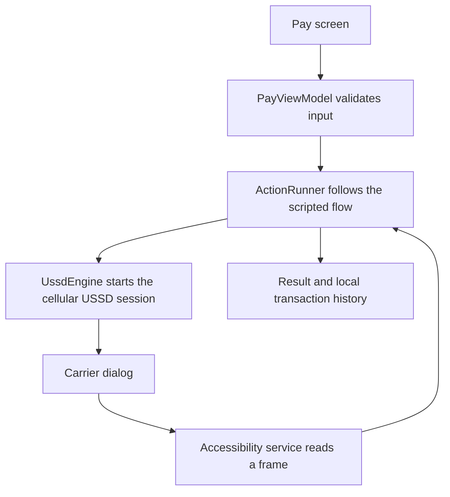
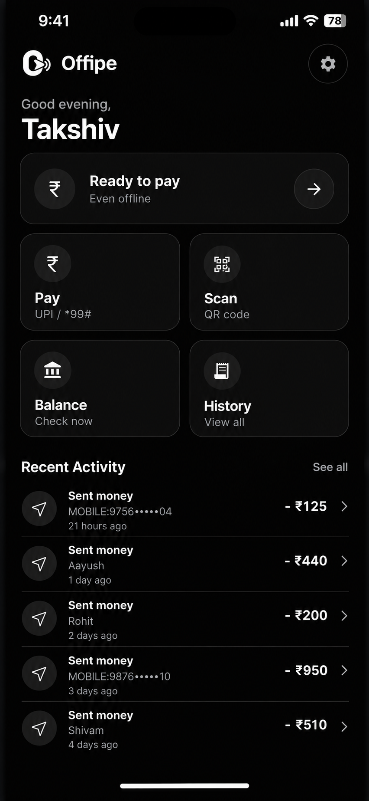
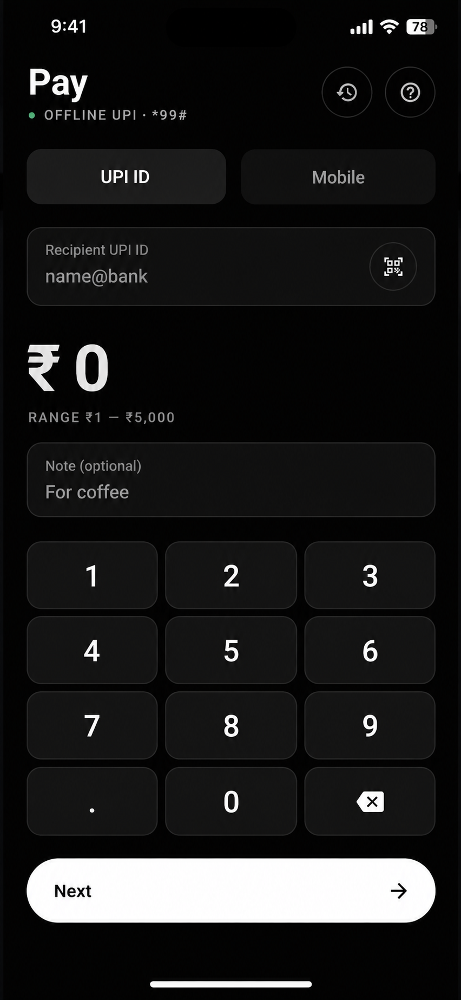
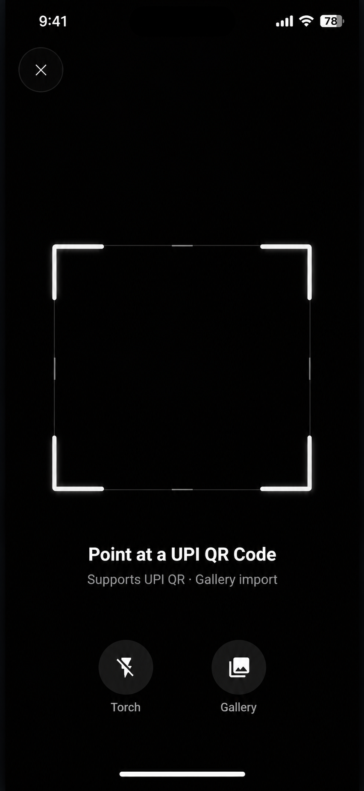
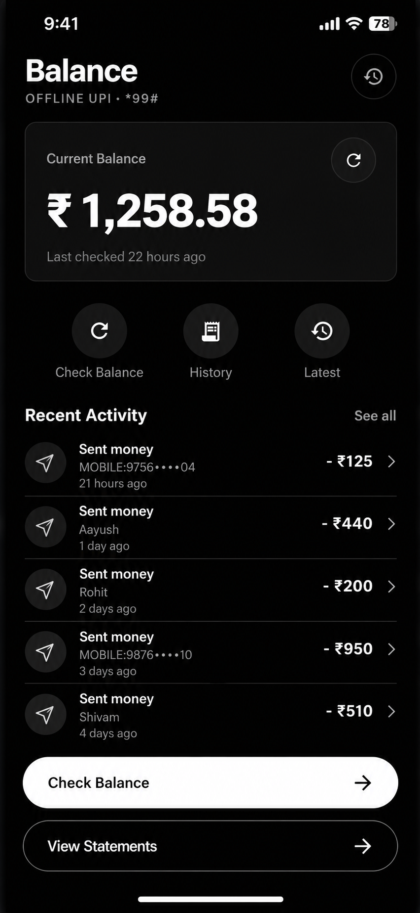
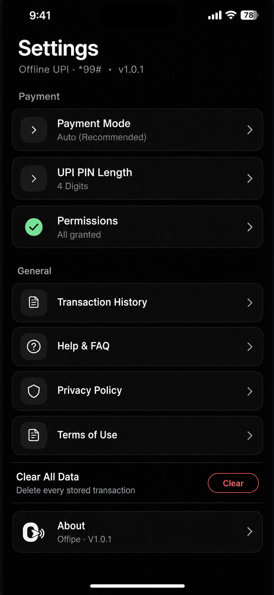

<div align="center">
  
  <h1>Offipe</h1>
  <p>Offline UPI payments through India's <code>*99#</code> USSD service.</p>
</div>

<p align="center">
  <a href="LICENSE"></a>
  <a href="https://github.com/codertakshiv/offipeapp"></a>
  
  
</p>

<p align="center">
  <a href="https://github.com/codertakshiv/offipeapp">Repository</a> ·
  <a href="https://github.com/codertakshiv/offipeapp/releases">Releases</a>
</p>

## 📡 What is Offipe?

Offipe is an unofficial Android client for UPI payments over the carrier's `*99#` USSD service. It automates the menu-driven interaction that would otherwise require dialing codes and entering each response by hand. A cellular connection to the carrier is still required; mobile data is not part of the USSD payment flow.

Offipe is not a bank, payment processor, or replacement for the carrier service. The bank and carrier process each transaction through their existing USSD systems.

## 🔄 How it works

1. The user opens Pay, enters a UPI ID (or scans a UPI QR code), an amount, an optional note, and a UPI PIN.
2. In Auto mode, Offipe starts the appropriate `*99#` session and its accessibility service reads the carrier dialog.
3. The action runner matches each prompt and submits the corresponding response. The user confirms the transaction in the flow.
4. The result is shown in Offipe. Successful UPI payments are recorded in local history.

In Manual mode, Offipe copies the UPI ID and opens the system dialer with the payment code. The user completes the carrier prompts themselves.



## 🖼️ Screenshots

| Home | Pay | Scan QR | Balance | Settings |
|:---:|:---:|:---:|:---:|:---:|
|  |  |  |  |  |

## Features

- Send a payment to a UPI ID using the `*99#` USSD flow. Amounts are limited to ₹1–₹5,000 with up to two decimal places.
- Scan a UPI QR code with the camera or decode one from a gallery image. QR data is parsed on-device.
- Check and locally retain the latest balance response.
- Browse recent successful payments, up to 200 records, and prefill a previous UPI payment.
- Choose Auto or Manual in Settings. Auto uses the accessibility service and overlay; Manual opens the dialer and leaves the carrier prompts to the user. An Advanced mode path remains in code but is not offered by the Settings selector.
- Complete onboarding, choose a display name, configure PIN length, and review permission guidance.
- Look up the name associated with a mobile number. Mobile lookup is currently name lookup only; payment to a mobile number is not implemented.

## Project details

- App version: `1.0.1` (version code `2`)
- Android SDK: minimum `26`, target `34`, compile `35`
- Language and toolchain: Kotlin `2.1.21`, Java `17`
- UI and navigation: Jetpack Compose Material 3, Navigation Compose `2.8.5`
- Camera and QR: CameraX `1.4.1`, ML Kit Barcode Scanning `17.3.0`
- Local data: Room `2.7.1`, SQLCipher `4.5.4`, DataStore Preferences `1.1.1`
- Async: Kotlin Coroutines `1.9.0`

## Permissions explained

The manifest declares:

- `CALL_PHONE`: starts the `*99#` call session.
- `CAMERA`: provides the live QR scanner. Gallery image decoding uses the selected image URI.
- `READ_PHONE_STATE`: included in the phone-permission bundle and available to SIM/carrier inspection code. The current payment flow does not call `CarrierDetector` to reject a carrier.
- `SYSTEM_ALERT_WINDOW`: allows the Auto-mode overlay to appear over the carrier dialog.
- Accessibility service binding: Android binds the declared service so it can inspect and respond to the carrier dialog after the user enables it in system settings.

There is no `INTERNET` permission in the app manifest. GitHub help links open an external browser when selected; those links are not used by the payment flow.

## 📦 Install

Download an APK from [GitHub Releases](https://github.com/codertakshiv/offipeapp/releases), install it, and grant the permissions needed for the mode you intend to use. A phone with a cellular voice SIM and `*99#` service is required for live payments.

For a source build, use JDK 17 and an Android SDK that includes API 35:

```bash
# Linux, macOS, or Codespaces
./gradlew assembleDebug
```

```bat
:: Windows
.\gradlew.bat assembleDebug
```

The debug APK is written to `app/build/outputs/apk/debug/app-debug.apk`. When sideloading on Android 13 or later, Android may block the accessibility service as a restricted setting. Open Settings → Apps → Offipe → the three-dot menu → Allow restricted settings, then enable Offipe under Accessibility.

## 🔐 Privacy and security

- Transaction records and the saved balance are stored in the app-private Room database protected by SQLCipher. On first run, Offipe generates a random 32-byte database key and wraps it using AES-256-GCM with an Android Keystore key; the encrypted key and IV are kept in private SharedPreferences.
- DataStore holds preferences such as operation mode, PIN length, onboarding state, and display name. These preferences are not stored in the SQLCipher database.
- The PIN is held as a Kotlin `String` in ViewModel state, masked in the UI, and removed from that state shortly after a session ends. This is not guaranteed memory zeroization: immutable JVM strings may remain in memory until reclaimed.
- Mobile number lookup state is held in the active UI/session only and is not added to transaction history.
- Android backup is disabled and extraction rules exclude app data from cloud backup and device transfer.
- The app has no declared internet permission or app API client. USSD traffic still uses the carrier network and is subject to that network's security properties.

## ⚠️ Known limitations

- The supported banks and carriers depend on the carrier's and bank's `*99#` menus. `CarrierDetector` exists, but the payment flow currently does not invoke its unsupported-carrier check; do not rely on it to detect or block Jio.
- Payment amount validation is limited to ₹1–₹5,000 and two decimal places.
- Mobile number support currently stops after fetching and showing a recipient name. It cannot pay to a mobile number.
- A live USSD call needs a compatible cellular SIM and carrier service. An emulator can run the app and tests, but cannot verify a real `*99#` carrier session; this repository's live carrier flows have not been verified here.
- PIN state uses immutable `String` values, so clearing ViewModel state is not the same as securely erasing every copy from process memory.

## Project structure

```text
app/
├── src/main/java/com/offipe/app/
│   ├── data/          Room, SQLCipher, DataStore, repositories
│   ├── domain/        Actions, validation, parsers, session models
│   ├── platform/      USSD, accessibility, overlays, camera/QR
│   └── presentation/  Compose screens, ViewModels, navigation
├── src/main/res/      Android manifest resources and UI strings
├── src/test/          JVM and property-based tests
└── src/androidTest/   Instrumented Android tests
docs/
└── assets/
    ├── branding/      Logo artwork
    └── screenshots/   App screenshots
```

## Contributing

See [CONTRIBUTING.md](CONTRIBUTING.md) for contribution and testing guidance. [ARCHITECTURE.md](ARCHITECTURE.md) describes the current code organization and USSD flow.

## Credits

Offipe was created and is maintained by **Takshiv Kashyap** ([@codertakshiv](https://github.com/codertakshiv)).

## License

Offipe is distributed under the [MIT License](LICENSE).

## 📝 Short terms and conditions

- Use Offipe only with an account and SIM you are authorized to use. Check the recipient and amount before confirming; USSD payments may be irreversible.
- Your bank and carrier process transactions and control service availability, limits, and any fees. Offipe is provided on a best-effort basis and cannot guarantee every session will succeed.
- Keep your UPI PIN private and your device secure. USSD and accessibility behavior can vary by carrier and Android device.
- Offipe is not a registered payment service and is not affiliated with NPCI, any bank, carrier, or payment provider. Use it at your own risk.

This is a brief summary, not a replacement for the full Terms of Use in the app under Settings → Terms of Use.

## Disclaimer

Offipe is an independent project and is not affiliated with or endorsed by NPCI, any bank, telecom carrier, or payment service provider. USSD menus and network availability are controlled by those providers. Review each carrier prompt carefully and use Offipe at your own risk.
